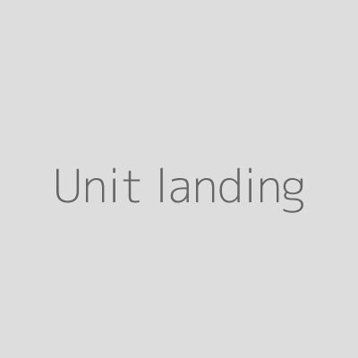

## Introduction

&lt;br&gt;
This section will provide guidance on waht to do if an adversary tries to silence you by taking down or defacing your website.

&#39;new&#39;

&lt;br&gt;
Prevent your website from being attacked or defaced.
this is still emegeny, don&#39;t use prevent in language
