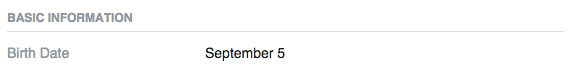
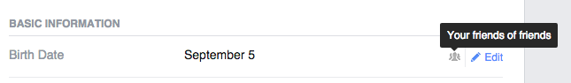
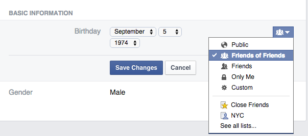

You can control who can see various elements of your profile. This doesn&#39;t happen in the main privacy settings but directly when editing your profile.
&lt;br&gt;
For instance going to About &gt; Contact &amp; Basic Info you can see your date of birth:

&lt;br&gt;
If you place your mouse cursor over it, you will see an icon which can be a globe (public), a group (friends of friends), a lock (only me) or possibly other images.

&lt;br&gt;
Clicking on this icon will bring up a menu where you can change this setting:

