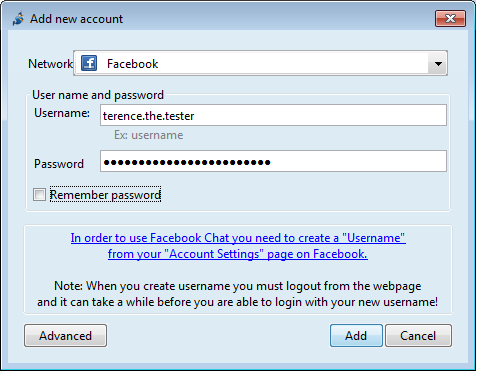

## Adding a Facebook account on Jitsi

Facebook has two settings that you might need to change before Jitsi can connect to your Facebook Chat.
&lt;br&gt;
# Facebook Username
Facebook requires a username for Jitsi to connect to Facebook chat. Many Facebook users already have a username.
&lt;br&gt;
To check your username, log in to your Facebook account: your username is what appears in the location bar of your browser after https://www.facebook.com/ when you view your Timeline or Page.
&lt;br&gt;
Your username is also included in your Facebook email address (e.g. username@facebook.com).
&lt;br&gt;
You can get a new Facebook username by going to your Account Settings &gt; General section or by visiting https://www.facebook.com/username.
&lt;br&gt;
To set a new username Facebook might want to verify your account, which might require sending an SMS to a mobile phone number which you will need to provide to Facebook in the verification process.
&lt;br&gt;
For more details see Facebook’s explanation of usernames.
&lt;br&gt;
# App Settings
Facebook’s “application platform” needs to be turned on before Jitsi can connect to Facebook Chat.
&lt;br&gt;
Visit your Facebook Account Settings &gt; Apps section and check that the setting for “Apps you use” is turned “On”.
&lt;br&gt;
**Note:** Turning Facebook’s &quot;application platform&quot; on opens up much of your Facebook data to third-party application developers.
&lt;br&gt;
This data is available not only to the Facebook applications that you use, but also to the Facebook applications used by any of your friends.
&lt;br&gt;
After turning on Facebook’s &quot;application platform&quot;, be sure to check the settings under &quot;Apps others use&quot;. This allows you to hide some personal information from applications used by your friends.
&lt;br&gt;
Unfortunately, Facebook does not offer settings to hide all personal information.
&lt;br.
Certain categories of information (like your friend list, gender, or info you have made public) are visible as long as Facebook’s &quot;application platform&quot; is turned &quot;on&quot;. It is up to you to determine whether this is an acceptable trade-off.
&lt;br&gt;
Now you are prepared to add your Facebook account on Jitsi. To do this follow the steps below:

# Step 1: Add new Jitsi account
Select **File &gt; Add New Account...** in the main menu bar of Jitsi.
&lt;br&gt;
# Step 2: Add new Facebook account
In the &quot;Add New Account&quot; dialogue, *Network* menu choose Facebook, enter your username and password and Click **&quot;Add&quot;**.

