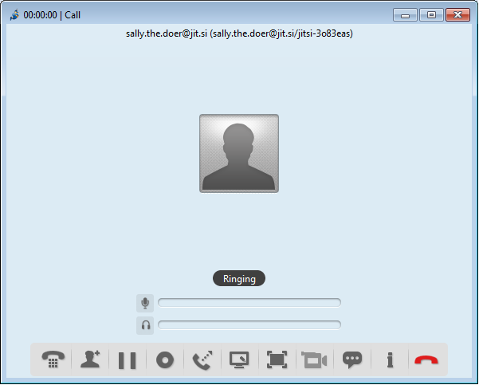
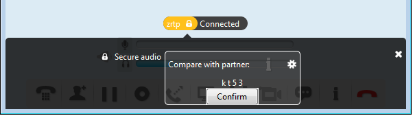

## Encrypting Facebook voice calls

Jitsi offers voice and video chats which can be independently encrypted with open standard called ZRTP.
&lt;br&gt;
# Step 1: Select your contact
Click on the contact in Jitsi contact list and click on the voice (second icon from the left under the contact&#39;s name) or video (third) icon - see figure 5 above. A new window will appear indicating that Jitsi is establishing the connection:

&lt;br&gt;
Your contact will see incoming call notification:

&lt;br&gt;
&lt;br&gt;
# Step 2: Accept the call
If your contact accepts the call you will receive information that you are connected:

Note the red open padlock. This means that your call is not yet encrypted with ZRTP.
&lt;br&gt;
# Step 3: wait

Wait... Your and your contact&#39;s programs are establishing an encrypted connection, which may take a moment.
&lt;br&gt;
If they succeed you will see the letters zrtp appear against an orange backgrond with a closed padlock like below. If they don&#39;t succeed in establishing a connection, you still can chat but without encryption
&lt;br&gt;
You can disconnect, restart Jitsi and try again to see if this time the programs will connect with encryption. ZRTP may not work in calls between accounts from different providers (such as between Google and Jit.si).

&lt;br&gt;
# Step 4:: Confirm encryption
Observe the section under the letters zrtp and padlock with the message &quot;Compare with partner&quot; followed by 4 characters. Read these letters to your contact and ask if she sees the same characters. If she does, it means that your communication is encrypted and nobody is interfering with it. You can click Confirm. The orange zrtp field will turn green:

&lt;br&gt;
# Step 5: Close confirmation box
You may close the black confirmation section of the window by clicking on the white x sign on upper-right part of the black section:

Jitsi lets you voice and video chat with more than one person. Note that with this communication, ZRTP encryption can be engaged between initiator of the call and other parties, but not between parties themselves.
