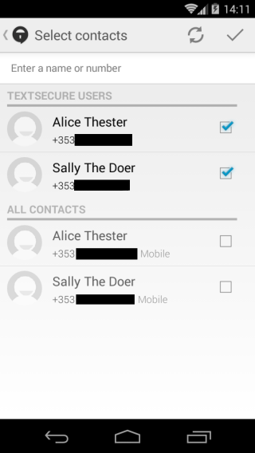
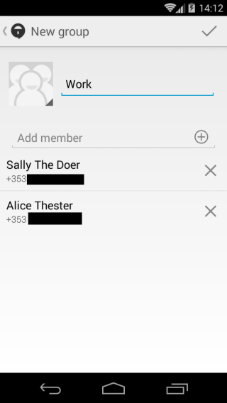
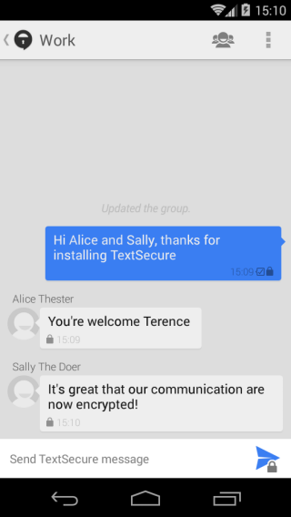

## Message groups

# Basics
Signal also allows you to message multiple people at once.
&lt;br&gt;
**Note:** If at least one of the people you are messaging does not use Signal, the messages will be sent as an MMS and not encrypted.
&lt;br&gt;
# Step 1: Create new group
Tap on the top right of your screen to bring up the menu and select &quot;New group&quot;
&lt;br&gt;
# Step 2: Name your group
Enter a name for your chat group and tap &quot;+&quot; to add your contacts.
&lt;br&gt;
# Step 3: Add contacts
Tap the box to the right of each contacts name to add them to the group and press the check mark
&lt;br&gt;

&gt; Contact selection

&lt;br&gt;

&gt; Group Creation

&lt;br&gt;
# Step 4: Complete group creation
Tap the checkmark to complete the creation of the group and be brought back to the Signal main screen.
&lt;br&gt;
# Step 5: Start messaging
Tap on the group you have created and begin messaging the group.
&lt;br&gt;

&gt; Group conversation
