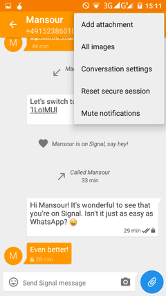
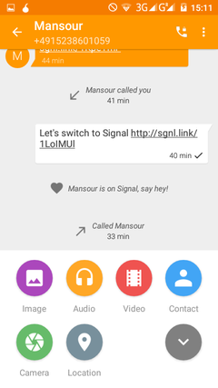

## Sending files

# Basics
Signal allows you to send images, video and audio files to your contact.
&lt;br&gt;
# Step 1: Start a conversation
Start a conversation with the person you want to send the file to.
&lt;br&gt;
# Step 2:
Tap the top right of your screen to bring up the menu and select &quot;Add attachment&quot;
&lt;br&gt;

&gt; File type selection

# Step 3: Select the type of file
Choose from the list the type of file that you want to send - Picture / Video / Audio
&lt;br&gt;

&gt; Image sent to contact

# Step 4: Select the file
Select the file you want to send.
&lt;br&gt;
# Step 5: Verify the file
Verify that the file you want to send is in the compose window and press to send.
