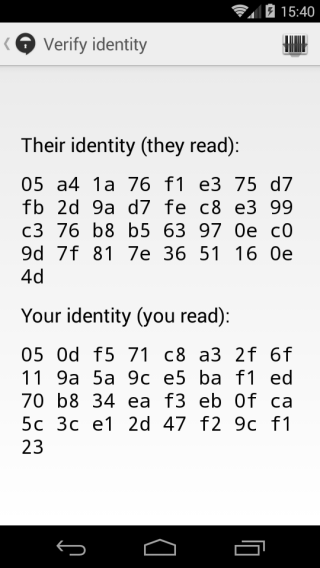

## Read fingerprints

# Basics
To confirm that the messages you are sending and receiving are with the right person, you should both verify your Signal identities with each other by verifying fingerprints.
&lt;br&gt;
# Step 1: Open existing conversation
Open an existing conversation with your contact and tap at the top of the screen.
&lt;br&gt;
# Step 2: Verify identity
Tap &quot;Verify Identity&quot; from the pull-down menu.
&lt;br&gt;
# Step 3: Find fingerprint
You will be presented with a 66-character fingerprint of your Signal identity and that of your contacts.
&lt;br&gt;

&gt; Signal fingerprints

&lt;br&gt;
# Step 4: Read fingerprint
Verify that you both have the same fingerprints for each other, either in person or via a medium that allows you to confirm visually or audibly to whom you are talking.
