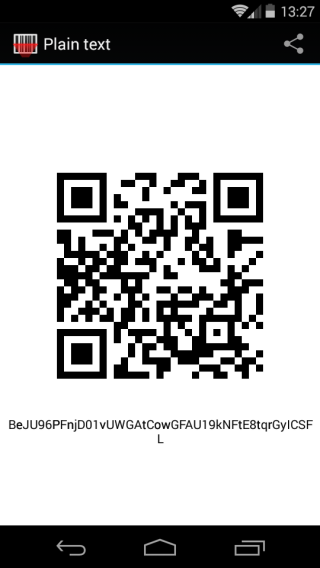
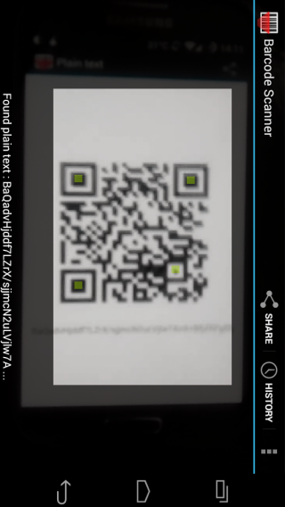
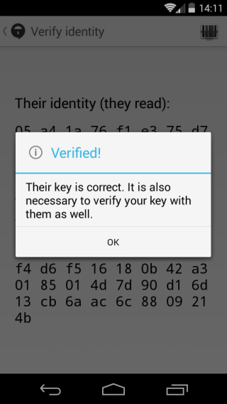

## Scanning fingerprints

**Note:** To verify fingerprints by scanning you need to have Barcode Scanner installed on your phone. If it is not available on your phone at the time of scanning Signal will download and install the app for you.
&lt;br&gt;
# Step 1: Open existing conversation
Open an existing conversation with your contact and tap at the top of the screen.
&lt;br&gt;
# Step 2: Verify identity
Tap &quot;Verify identity&quot; from the pull-down menu.
&lt;br&gt;
# Step 3: Find fingerprint
You will be presented with a 66-character fingerprint of your Signal identity and that of your contacts.
&lt;br&gt;
# Step 4: Click on barcode
On both your phones tap on .
&lt;br&gt;
# Step 5: Prepare to scan
On your phone tap &quot;Scan your key to compare&quot; and your contact should tap &quot;Get my key scanned&quot;. Your contact&#39;s phone will display a QR code and your phone will open Barcode Scanner.
&lt;br&gt;

&gt; Your contact&#39;s QR code

&lt;br&gt;
# Step 6: Scan QR code
Use Barcode Scanner on your phone to scan your contact&#39;s QR code.
&lt;br&gt;

&gt; Barcode scanner

&lt;br&gt;
# Step 7: Check that identity is valid
Once the QR code has been successfully scanned Signal will check that the identity is valid.
&lt;br&gt;

&gt; Signal identity verified

&lt;br&gt;
# Step 8: Repeat to verify yours
Once you have verified your contact&#39;s Signal identity, they should repeat the above steps to verify yours.
&lt;br&gt;
