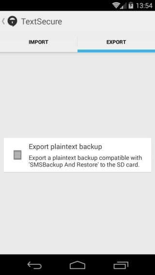
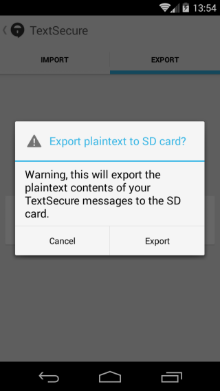

## Export your messages

**Note:** While Signal allows you to export your messages, the messages in the backup file will not be encrypted and you should take additional steps to protect its contents.
&lt;br&gt;
# Step 1:
Tap on the top right of the main Signal screen to bring up the menu and select &quot;Import/Export&quot;
&lt;br&gt;
# Step 2: Select
 The next screen will open on the import options, tap &quot;Export&quot;
&lt;br&gt;
# Step 3:
On the export screen tap &quot;Export plaintext backup&quot;
&lt;br&gt;

&gt; Signal export

# Step 4:
Confirm that you want to export the unencrypted messages to the storage on your phone by tapping &quot;Export&quot;
&lt;br&gt;
# Step 5:
Signal will confirm the export has completed by displaying &quot;Success!&quot; You will find a file called Textsecure.xml on your phone&#39;s storage that contains your unencrypted messages.
&lt;br&gt;

&gt; Export confirmation screens
