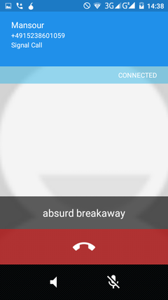

## Making a call

# Tap on a contact
Tap on a contact. If they have Signal there will be a padlock on the top right of the screen.
&lt;br&gt;
# Call your contact.
When your contact answers you&#39;ll see two words.
&lt;br&gt;
# Verify caller&#39;s identity
Say one word to your friend and ask them to say the other word. This makes sure you are both who you say you are.
&lt;br&gt;

