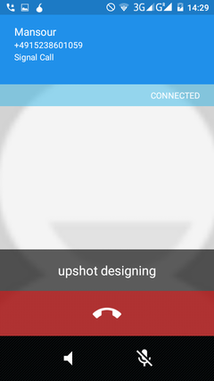

## To take a call

# Call alert
When you get a signal call, you&#39;ll see on your screen &quot;SIGNAL CALL&quot;
&lt;br&gt;
# Caller verification
When you answer you&#39;ll see two words. Say one word to your friend and ask them to say the other world. This makes sure you are both who you say you are.
&lt;br&gt;

