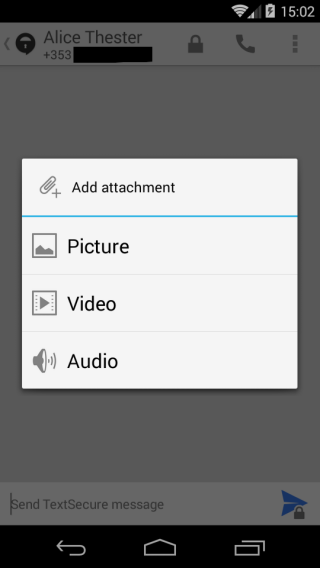
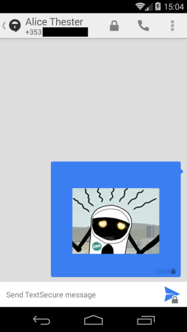

To make a call
Tap on a contact. If they have Signal there will be a padlock on the top right of the screen.
&lt;br&gt;
Call your contact. 
When your contact answers you&#39;ll see two words.
Say one word to your friend and ask them to say the other word. 
This makes sure you are both who you say you are.

&lt;br&gt;
To take a call
When you get a signal call, you&#39;ll see on your screen &quot;SIGNAL CALL&quot;
&lt;br&gt;
When you answer you&#39;ll see two words. 
Say one word to your friend and ask them to say the other world. 
This makes sure you are both who you say you are.

