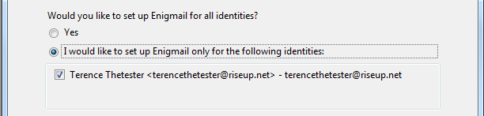
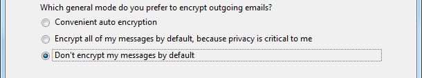
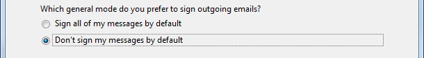
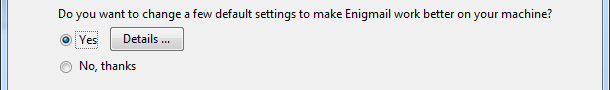
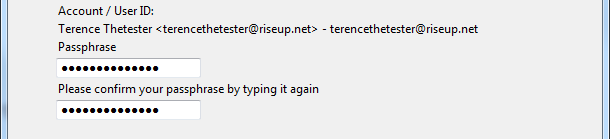
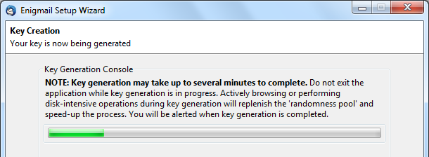
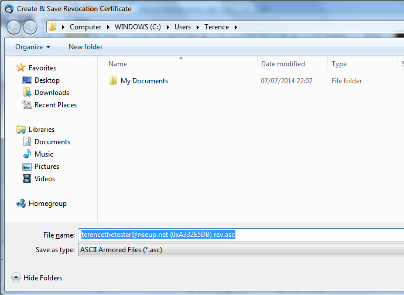

## Generate a key pair

# Step 1: Open the Setup Wizard
Select Enigmail &gt; Setup Wizard to open the Enigmail Setup Wizard screen as follows:

&lt;br&gt;
# Step 2. Select identities for keys
Click &quot;Next&quot; to activate the following screen. Note - this screen will only appear if you have set up key pairing for another account.

&lt;br&gt;

# Step 3. Turn off auto encryption
Click &quot;Next&quot; to activate the following screen:

&lt;br&gt;

# Step 4. Turn off signing messages by default
Click &quot;Next&quot; to activate the following screen:

&lt;br&gt;
# Step 5. Change default settings
Click &quot;Next&quot; to activate the following screen:

&lt;br&gt;
# Step 6. Create a key to sign and Encrypt
Click &quot;Next&quot; to activate the *Create Key - Create A Key To Sign and Encrypt Email* window.
&lt;br&gt;
Note: The first time you attempt to create a key for an email account, the No OpenPGP Key Found screen will appear.
&lt;br&gt;
# Step 7. Create a new key pair
Select I want to create a new key pair for signing and encrypting my email.
&lt;br&gt;
# Step 8. Create a strong Password
Type a strong passphrase into both the Password fields. Refer to the [Passwords](en/topics/understand-4-digisec/2-passwords/1-1-intro.md) lesson to learn how to do so.

&lt;br&gt;
# Step 9. Activate the summary screen
Click &quot;Next&quot; to activate the Summary screen, which displays the settings used while generating the key pair.
&lt;br&gt;
# Step 10. Start key pair generation
Click &quot;Next&quot; to start the key pair generation, as shown in the following screen:

&lt;br&gt;

**Note:** Any key pair generated using Enigmail Setup Wizard is automatically has a 4096-bit size, and a lifespan of 5 years.
&lt;br&gt;
# Step 11. Create revocation certificate
After the key is generated, you will be prompted to create a revocation certificate. Click &quot;Generate certificate&quot; as shown in the following screen:

&lt;br&gt;

**Note:** If you know that a hostile or malicious party has gained unauthorised access to your private key or you lost access to this key, you may send the revocation certificate to your contact to let them know that they should not use your matching public key.
&lt;br&gt;
Keep in mind that you might need to do this if your computer is lost, stolen or confiscated. You are strongly advised to back up and protect your revocation certificate.
&lt;br&gt;
# Step 12. Save your revocation certificate
You will be asked to type in the password that you associated with your newly created key. And then navigate to a location where you can store the certificate safely and click on following screen:

&lt;br&gt;
# Step 13. Complete generation of key pair and revocation certificate
Click &quot;Next&quot; to complete generating both a key pair and revocation certificate.
