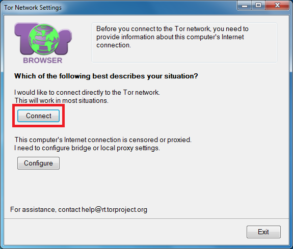
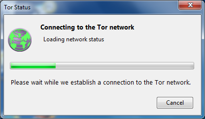
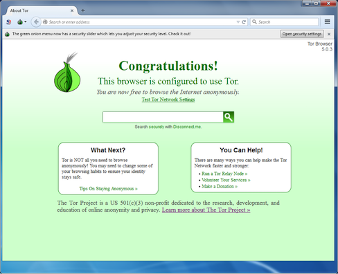
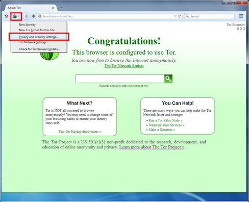
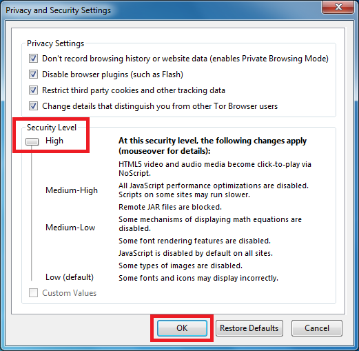

## Connect to the Tor network

The first time Tor Browser starts, you&#39;ll get a window that allows you to modify some settings if necessary. You might have to come back and change some configuration settings, but go ahead and try to connect to the Tor network by clicking the Connect button.

&lt;br&gt;
A new window will open with a green bar that illustrates Tor Browser connecting to the Tor network.

&lt;br&gt;
The first time Tor Browser starts it might take a bit longer than usual; but be patient, within a minute or two Tor Browser will open and congratulating you.

&lt;br&gt;
Click on the Tor Onion logo in the upper left of Tor Browser then the Privacy and Security Settings.

&lt;br&gt;
Some features of a normal web browser can make you vulnerable to man-in-the-middle attacks. Other features have previously had bugs in them that revealed users&#39; identities.
&lt;br&gt;
Turning the security slider to a high setting disables these features. This will make you safer from well-funded attackers who can interfere with your Internet connection or use new unknown bugs in these features.
&lt;br&gt;
Unfortunately, turning off these features can make some websites unusable. The default low setting is fine for everyday privacy protection, but you can set it to high if you are worried about sophisticated attackers, or if you don&#39;t mind if some websites do not display correctly.

